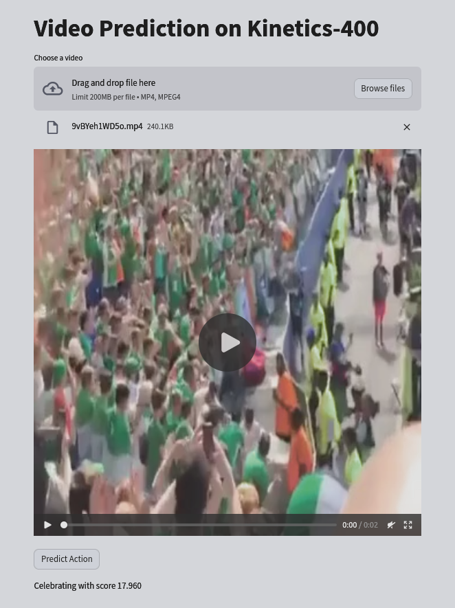

# Video Classification Deployment FastAPI Kubernetes

*Author: Martine Toering*


The project serves as a machine learning (ML) deployment tutorial and MLOps practice. It containerizes and deploys a video classification model trained on Kinetics-400 as a simple FastAPI app to Kubernetes with minikube.

Features:
- Video classification model in ONNX format
- Simple `fastapi` app containerized with `docker`
- Deployment to Kubernetes with `minikube`
- Simple UI with `streamlit`
- Basic Github Actions workflow for Kubernetes deployment

<p align="center">

</p>

## Get started

### Prerequisites

Download  the ONNX model files [here](https://drive.google.com/drive/folders/1AzRUBkzn5ERdEcr6Uxatro4oQ46WzEWY?usp=sharing).
Next, put the `model_onnx` folder in `app`.

Poetry is used in this project. To install the version of poetry used, do:

```bash
pip install -r requirements.txt
```

The `pyproject.toml` file contains the environment with the packages used in this project. To install these packages you can for instance use:

```bash
poetry install --without dev
```

### FastAPI

FastAPI is a framework for building RESTful APIs in python. It is suitable for machine learning model serving.

The `fastapi_app` folder contains a file `main.py` that implements a simple FastAPI app. The endpoint `/predict` accepts POST requests with input data and returns predictions from the model. The model is loaded in once at startup to avoid performance issues.

Test the API locally by `cd fastapi_app` and the following command:

```bash
uvicorn main:app --reload
```

After which you can send a request with e.g.

```bash
curl -X POST -F video_file=@example_data/k400tiny_videos/Z4tTlrIX0IQ.mp4 localhost:8000/predict/
```

See `example_data` for a few example video files.

### Streamlit UI

While the FastAPI app is running, go to the `streamlit` folder, install necessary packages and run the streamlit UI with:

```bash
streamlit run app.py
```

### Docker

Next, we are going to containerize the app with Docker, to create a consistent and portable deployment environment. See `Dockerfile` for how we do this; see below for reference:

```
FROM python:3.11

WORKDIR /app

# Install poetry version
COPY ./requirements.txt /app/requirements.txt
RUN pip install --no-cache-dir -r /app/requirements.txt

# Install poetry dependencies
COPY ./pyproject.toml /app/pyproject.toml
COPY ./poetry.lock /app/poetry.lock
RUN poetry install --no-root

# Copy code
COPY ./fastapi_app /app

RUN poetry install

EXPOSE 8000

CMD ["poetry", "run", "uvicorn", "main:app", "--host", "0.0.0.0", "--port", "8000"]
```

We make sure to install dependencies before copying code. This ensures that when the code is modified, the dependencies do not have to be reinstalled because of docker layer caching.

We can test the container locally by executing some commands below.

For building the docker, we can use:

```bash
docker build -t <image_registry>/<image_name> .`
```

In my example, we can do:

```bash
docker build -t martinetoering/videopredict_deploy .
```

To run the container we can then do the following:
```bash
docker run -p 8000:8000 martinetoering/videopredict_deploy
```
after which we can test the exposed API endpoint against predictions:

```bash
curl -X POST -F video_file=@example_data/k400tiny_videos/alYgwCPj4wQ.mp4 http://127.0.0.1:8000/predict/
```

In a deployment setting, we would have to push the docker container to an image registry so that we can make use of it in deployment later, with e.g.:

```bash
docker login
docker push martinetoering/videopredict_deploy
```

In our case of local development, this is not needed.

### Kubernetes deployment manifest (YAML file)

The kubernetes YAML file will describe our type of deployment and the resources that we would like to use in the Kubernetes cluster.

Our `kubernetes.yaml` has two parts: a `Deployment` and a `Service`. The `Deployment` part will configure the Kubernetes pods and resources; we will keep it simple and use a single Pod. The `Service` will use the Kubernetes NodePort type which is a way to expose the Pod to the outside world. Another common type is `LoadBalancer` which serves as a way to distribute traffic among pods.

We will use `imagePullPolicy: Never` in the manifest for local development purposes, so that we do not have to push and pull the image. However, in order for minikube to be able to use your local docker build later, we will run this first:

```bash
eval $(minikube docker-env)
```

And then build the docker container again:

```bash
docker build -t martinetoering/videopredict_deploy .
```

This ensures that minikube can use your locally build docker container. NOTE: This command is only valid for the current terminal. [Link for reference](https://minikube.sigs.k8s.io/docs/handbook/pushing/).

### Deploy to Kubernetes (with Minikube)

Minikube is a Kubernetes engine for creating a kubernetes cluster on a local machine. Minikube is useful for developers testing simple kubernetes environments locally.

Check whether minikube is installed:
```bash
minikube version
```

Initialize `minikube` with:

```bash
minikube start --driver=docker
```

And deploy to your cluster:

```bash
kubectl apply -f kubernetes.yaml
```

Check your Kubernetes deployment, service and pod with the following commands:

```bash
minikube service --all
kubectl get deployments
kubectl get service
kubectl get pods
```

It may take a few moments before the service has started up.

### Access the API

Check whether you can access the service with:

```bash
minikube service videopredict-service
```

You should get the welcome message from the API. The containerized FastAPI is running in the minikube cluster and you can send requests to it with the following:

```bash
curl -X POST -F video_file=@example_data/k400tiny_videos/Z4tTlrIX0IQ.mp4 <external_url_ip>/predict/
```

### Github Actions workflow

We included a simple workflow in `.github/workflows` named `deployment.yaml` as a build and test step following [this article at Minikube](https://minikube.sigs.k8s.io/docs/tutorials/setup_minikube_in_github_actions/).


### See also

- [Training pipeline for video classification on Kinetics-400](https://github.com/martinetoering/video-ml-training)
